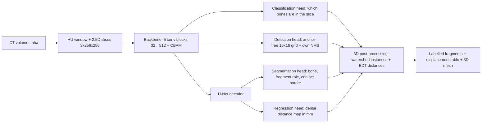

# 🦴 PENGWIN · Pelvic Fracture Detection → Fragment Segmentation → Displacement in mm

[](https://www.python.org/)
[](https://pytorch.org/)
[](https://simpleitk.org/)
[](https://scikit-image.org/)
[](https://streamlit.io/)
[](https://plotly.com/)

**PENGWIN** is an end-to-end computer-vision system for pelvic fractures on CT: it finds each pelvic bone on every slice, segments every bone fragment and assigns it to the bone it broke from, measures how far each loose fragment ended up from its parent bone **in millimetres**, and shows it all in an interactive 3D dashboard — built on a custom multi-task network, with no off-the-shelf detector or segmenter behind it.

> Data: **PENGWIN Task 1 (CT)**, MICCAI 2024 challenge — 100 annotated CT scans, fragment masks validated by orthopaedic surgeons ([Zenodo](https://doi.org/10.5281/zenodo.10927452), CC BY 4.0).
> **Team**: Carlos Andrés Orozco Caicedo · José David Mesa Ramírez · Sara Lucía Rojas Mejía · Esteban Cobo Gómez 🇨🇴

> ⚠️ Research / educational project. **Not a medical device**, not clinically validated, not for surgical decisions.

---

## 🎯 Project direction

Pelvic fractures are hard to plan because a surgeon needs three answers per fragment: *which bone is it from, where is it, and how far did it move?* Answering that by hand takes up to an hour per complex case.

This project deliberately **does not** wrap YOLO, Detectron2 or a pretrained Mask R-CNN. Every piece is built and tested in-house, so each design decision can be measured:

- ✅ **One backbone, four heads** — a 5-block CNN with CBAM attention feeding anatomical classification, an anchor-free detector (own grid + own NMS), instance segmentation and a dense distance-regression head.
- ✅ **3D where it matters** — the network reads 2.5D slices (each slice plus its neighbours), but fragment separation and every distance are computed on the stacked volume at native resolution, using the real voxel spacing.
- ✅ **Diagnostics before tuning** — a dedicated tool explains *why* a fragment is wrong (absorbed, split, merged, lost) instead of blindly sweeping hyper-parameters.
- ✅ **Robustness and interpretability as first-class outputs** — four synthetic degradation levels, BatchNorm γ analysis, Smooth Grad-CAM vs. objectness, and box-level IoU across the whole test set.
- ✅ **Honest evaluation** — patient-level splits (never slice-level), parameters chosen on validation and applied once to test, and metrics that look at both sides (Dice *and* fragment precision).

## 📊 Results

Held-out test set: **15 patients** never seen during training or tuning. Official configuration (post-processing chosen on validation).

| Task | Metric | Result |
|---|---|---|
| Anatomical classification | F1 / AUC | **0.987 / 0.999** |
| Bone detection | Box IoU | **0.885** |
| Bone detection | mAP@0.50 / mAP@[0.50:0.95] | **0.877 / 0.750** |
| Fragment segmentation | Dice / IoU | 0.676 / 0.597 |
| Fragment segmentation | HD95 / ASSD | 21.5 mm / 4.6 mm |
| Fragment instances | Precision / recall | 0.602 / 0.879 |
| Displacement | Mean abs. error (geometric) | 5.1 mm |
| Inference | Latency | ~8 ms per slice on an RTX 3060 Laptop (~3 s of network time per CT) |

**Robustness** — the same test set with increasing noise, blur, resolution loss and contrast shift:

| Degradation | none | light | medium | heavy |
|---|---|---|---|---|
| F1 classification | 0.987 | 0.987 | 0.987 | 0.971 |
| mAP@0.50 | 0.877 | 0.877 | 0.876 | 0.845 |
| Fragment Dice | 0.676 | 0.660 | 0.627 | 0.574 |

**What the analysis showed**

- **Finding and locating bones is solved and robust** — detection and classification stay well above target even under heavy degradation; box IoU is 0.92 on the hip bones and 0.76 on the sacrum.
- **The hard part is touching fragments.** Main fragments reach Dice 0.91; the gap is in secondary fragments. Diagnostics show 38 % of them get *absorbed* into the main fragment — mostly large ones (median 35 mL), where the network can't tell which piece is "the main one". Thirteen post-processing variants didn't fix it: it's a model-level limitation of the main/secondary labelling scheme, the same one discussed in the challenge paper.
- **Dice hides false fragments.** On validation the model predicted 216 fragments for 90 real ones. A fragment-precision metric exposed it, and a 1 mL minimum fragment size chosen on validation (precision 0.38 → 0.62 there) gives 0.60 precision on test, at a measured Dice cost (0.711 → 0.676): a documented precision/Dice trade-off.
- **Transfer learning didn't help.** Initialising the backbone from a detector trained on natural photos gave the same results as training from scratch, and both models end with near-identical BatchNorm γ — training washes the initialisation out.
- **The network uses all its capacity** — no BatchNorm channel is switched off in any layer. Grad-CAM shows the classifier uses anatomical context (the opposite side and the spine) to tell left from right, while the detection head's objectness stays tightly on the bone.

---

## 🏗️ Architecture



6.8 M parameters, trained in four curriculum stages (detection → segmentation → distance → joint fine-tuning), mixed precision, ~5 h on a 6 GB laptop GPU.

```
src/
├── data/          .mha I/O with physical spacing, HU windowing, mmap slice cache, patient-level splits, augmentation
├── models/        extended backbone, CBAM, the four heads
├── losses/        7-term multi-task loss with gradient-calibrated weights
├── postprocess/   own NMS, 3D instance separation (watershed), edge-to-edge distance in mm
├── eval/          F1/AUC, IoU/mAP, Dice/IoU/HD95/ASSD, fragment precision, own Hungarian matching
├── analisis.py    BatchNorm γ, Smooth Grad-CAM, box analysis, fracture-case selection
├── inferencia.py  full-volume inference, GPU or CPU
└── dashboard/     Streamlit app + Plotly viewers

scripts/           one entry point per step: data, EDA, sanity checks, training, evaluation, diagnostics, SAM baseline
notebooks/         control notebook that runs the whole pipeline and renders every result
configs/           single source of truth for all parameters (+ ablation configs that change one factor)
pesos/             trained weights (main model and ablations)
docs/              results (JSON/CSV), installation guide, code guide
tests/             19 automated checks
```

---

## ⚙️ Install & Run

### 1. Environment

```bash
git clone https://github.com/ShadowBlack33/Proyecto-Analitica-de-Datos.git
cd Proyecto-Analitica-de-Datos

python -m venv .venv
.venv\Scripts\activate                 # Linux/macOS: source .venv/bin/activate

python -m pip install torch torchvision --index-url https://download.pytorch.org/whl/cu124
python -m pip install -r requirements.txt
python scripts/verificar_entorno.py    # checks every library and project module, plus the GPU
```

Install PyTorch **before** `requirements.txt`, so you get the CUDA build. Only an up-to-date NVIDIA driver is needed — not the CUDA Toolkit.

### 2. Data

Download the three Task 1 zips from [Zenodo](https://doi.org/10.5281/zenodo.10927452) into the folder above the repo, then:

```bash
python scripts/organizar_datos.py --zips .. --md5   # verifies checksums, unpacks, pairs images with labels
python scripts/preparar_datos.py                    # slice cache + patient-level split (sha256 99267ddb…)
python scripts/eda.py
```

### 3. Train, evaluate, infer

```bash
python scripts/train.py --nombre completo                       # full curriculum (~5 h on an RTX 3060)
python scripts/evaluar.py --ckpt pesos/completo.pth --nombre completo --degradacion 0 1 2 3
python scripts/inferir.py --ckpt pesos/completo.pth --ct data/raw/images/039.mha   # exports a labelled .mha
```

Pretrained weights are in `pesos/`, so evaluation and inference work without training. Interrupted runs resume with `--reanudar checkpoints/<name>/ultimo.pth`.

### 4. Dashboard

```bash
streamlit run src/dashboard/app.py
cloudflared tunnel --url http://localhost:8501      # optional: public link, works on a phone
```

### 5. Everything in one place

`notebooks/PENGWIN_pipeline.ipynb` walks through the full pipeline and renders every table and figure: EDA, sanity checks, training curves, test metrics, 2D/3D predictions, BatchNorm γ, Grad-CAM, box analysis and a gallery of fractured cases. It reads saved results and never retrains by accident.

---

## 🖥️ Dashboard

Three linked viewers over any CT:

- **Raw volume** — maximum-intensity projection of bone by HU threshold, before any model runs.
- **Slice-by-slice inference** — boxes, colour-coded fragment masks and the displacement in mm next to each fragment, with a slice slider.
- **3D reconstruction** — one marching-cubes mesh per fragment, coloured by parent bone (main fragment dark, loose fragments lighter), labelled with its displacement.

A fragment table and the measured latency sit alongside the viewers.

---

## 🔬 Analysis tooling

| Tool | What it answers |
|---|---|
| `scripts/diagnostico_fragmentos.py` | What happened to each real fragment (correct / absorbed / split / merged / lost), and whether the failure is the network or the post-processing |
| `… --barrido` / `--barrido_tamano` | Post-processing and minimum-fragment-size sweeps on **validation**, with a stated selection rule |
| `scripts/evaluar.py --degradacion 0 1 2 3` | Robustness under four fixed, reproducible degradation levels |
| `scripts/calibrar_lambdas.py` | Loss weights from gradient-norm balance on the shared backbone, instead of copied values |
| `scripts/overfit_test.py` · `perfil_memoria.py` | Correctness (can it memorise a batch?) and peak VRAM per resolution/batch |
| `scripts/baseline_sam.py` | Zero-shot SAM prompted with our boxes, as an out-of-domain baseline |
| `src/analisis.py` | BatchNorm γ per block, Smooth Grad-CAM vs. objectness, NMS before/after, box IoU on test |

---

## 🧾 Configuration

Everything lives in `configs/default.yaml`; ablations inherit from it and change exactly one factor (`configs/ablacion_sin_cbam.yaml`, `configs/ablacion_con_tl.yaml`).

```yaml
datos:
  resolucion: 256
  contexto: 1                 # 2.5D input: slice ± 1 neighbour = 3 channels
  ventana_hu: [-200, 1200]
  split: [0.70, 0.15, 0.15]   # by patient
modelo:
  canales: [32, 64, 128, 256, 512]
  cbam_en_bloques: [4, 5]
perdida:                      # gradient-calibrated weights
  lambda_cls: 0.5
  lambda_det_obj: 3.0
  lambda_det_box: 5.0
  lambda_sem: 1.0
  lambda_rol: 1.0
  lambda_borde: 2.0
  lambda_dist: 0.5
entrenamiento:
  batch_size: 16
  amp: true
postproceso:
  min_volumen_ml: 1           # chosen on validation with diagnostico_fragmentos.py --barrido_tamano
```

---

## 🔁 Reproducibility & tests

- Fixed seed across Python, NumPy and PyTorch; the patient split is versioned with a SHA-256 hash and refused if altered; every checkpoint stores a hash of its predictions on a fixed batch.
- `python -m pytest -q tests` runs 19 checks, including: own NMS vs. `torchvision.ops.nms`, own metrics and Hungarian matching vs. scikit-learn/SciPy, transfer-learning weight loading with numerical equivalence, exact ground-truth reconstruction by the post-processing, and fragment-precision bookkeeping.
- The pipeline runs on GPU or CPU; a synthetic-CT generator (`scripts/generar_datos_sinteticos.py`) lets the whole flow run without the real dataset.

---

## 🛠️ Troubleshooting

| Issue | Suggestion |
|---|---|
| `DLL load failed … An Application Control policy has blocked this file` (Windows) | Windows 11 **Smart App Control** blocks unsigned compiled files installed by pip. Turn it off in *Windows Security → App & browser control* (irreversible) or work inside WSL2 |
| `verificar_entorno.py` reports no GPU | PyTorch is the CPU build: reinstall with the `--index-url …/cu124` command and `--force-reinstall` |
| `CUDA out of memory` | Lower `batch_size` to 8 and set `acumulacion: 2` in the config |
| `OSError 22` from DataLoader workers on Windows | Pull the latest `main` (fixed), or set `num_workers: 0` |
| `splits.json` hash differs from `99267ddb…` | Your data differs from the team's: re-run `organizar_datos.py --md5` |
| Plotly figures don't render in the notebook | `pip install nbformat` and restart the kernel |

---

## 📜 Data, license & disclaimer

- **Data**: PENGWIN Task 1, MICCAI 2024 — [Zenodo](https://doi.org/10.5281/zenodo.10927452), CC BY 4.0. Cite the challenge if you use it.
- **Code**: © 2026 the authors.
- **Use**: research and educational purposes only. Not a medical device, not clinically validated, not for diagnosis or surgical planning.

## 👥 Team

**Carlos Andrés Orozco Caicedo** · **José David Mesa Ramírez** · **Sara Lucía Rojas Mejía** · **Esteban Cobo Gómez**
Data & AI Engineering · Universidad Autónoma de Occidente · Cali, Colombia 🇨🇴
