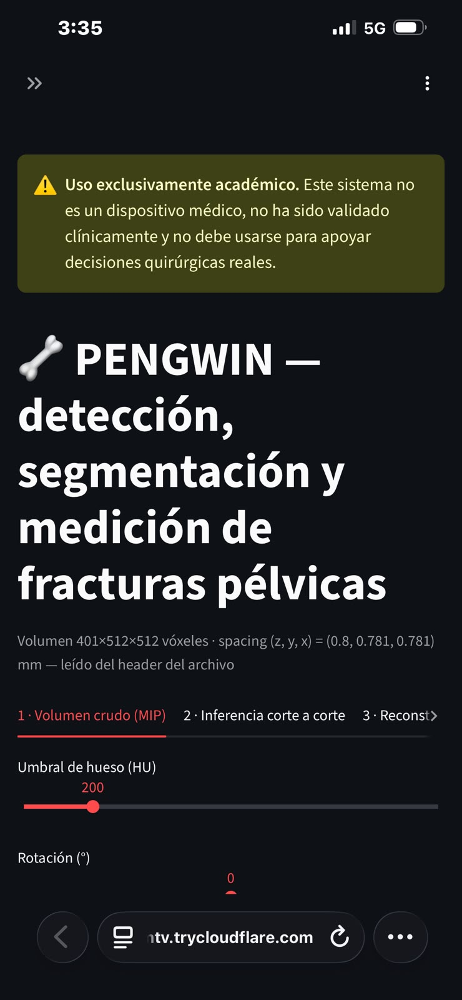
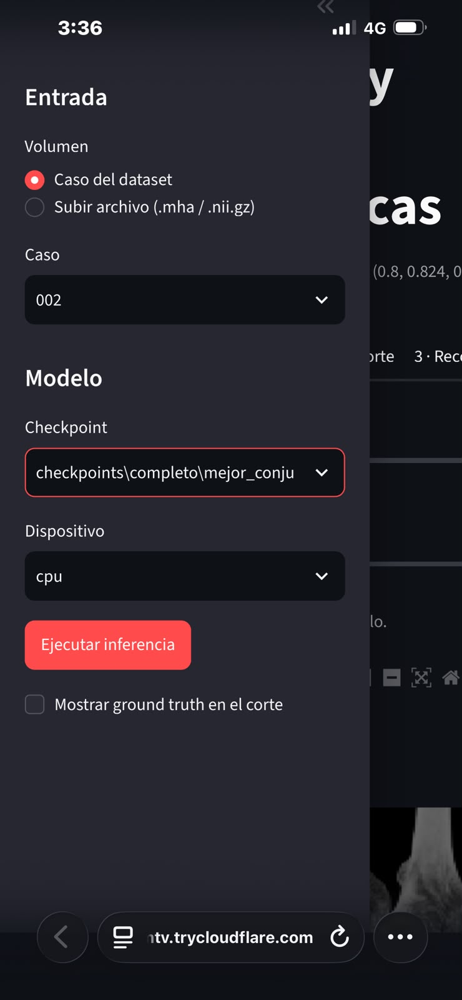
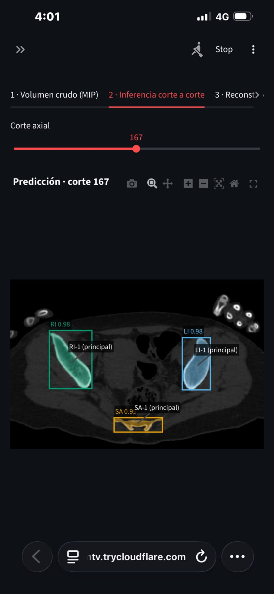
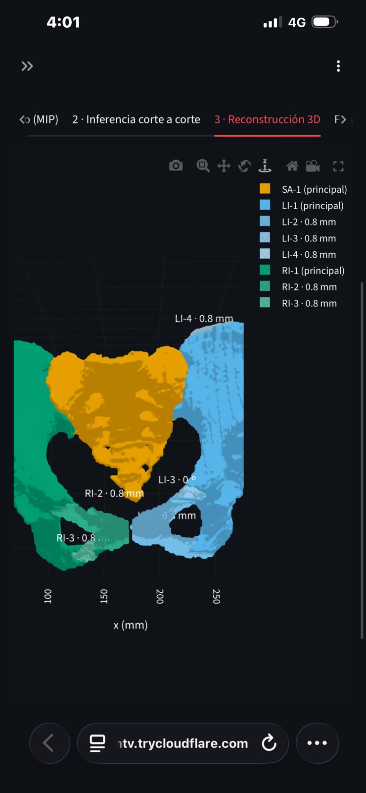
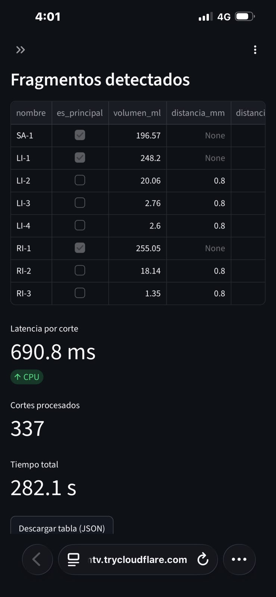

# Despliegue del dashboard PENGWIN (Streamlit + túnel de Cloudflare)

> ⚠️ Uso exclusivamente académico. No es un dispositivo médico ni está validado clínicamente.

Este documento explica cómo levantar el dashboard en un PC con Windows, publicarlo con un
túnel de Cloudflare para abrirlo desde un celular, y qué problemas
aparecieron al hacerlo. Se probó en un PC **sin GPU** (solo CPU): el pipeline completo corre
sin cambios en el código.

**Video de respaldo de la demo:** <https://youtu.be/JGUifamoWas>

---

## 1. Requisitos

| Componente | Versión probada | Nota |
|---|---|---|
| Windows | 11 | PowerShell 7 (`pwsh`) |
| Python | 3.11.9 | 3.10 o superior |
| PyTorch | 2.14.1+cpu | Sin GPU: instalar la versión CPU (ver problema 3) |
| Streamlit | 1.65.0 | `requirements.txt` exige ≥ 1.50 |
| cloudflared | 2026.8.3 | No requiere cuenta de Cloudflare |
| Git | — | Para clonar el repositorio |
| Disco | ~15 GB libres | 7 GB de zips + datos extraídos + caché |
| Datos | PENGWIN Task 1 (CT) | [Zenodo](https://doi.org/10.5281/zenodo.10927452), 3 zips |

Equipo de prueba: [PENDIENTE: procesador] · [PENDIENTE: RAM] GB de RAM · sin GPU NVIDIA.

---

## 2. Pasos

Todos los comandos se corren en PowerShell desde la raíz del repositorio, con el entorno
virtual activo (el prompt empieza por `(.venv)`).

### 2.1 Clonar e instalar

```powershell
cd C:\ruta\de\trabajo
git clone https://github.com/ShadowBlack33/Proyecto-Analitica-de-Datos.git
cd Proyecto-Analitica-de-Datos

python -m venv .venv
.venv\Scripts\activate
python -m pip install --upgrade pip

# Sin GPU NVIDIA:
python -m pip install torch torchvision
# Con GPU NVIDIA (p. ej. el PC de Carlos):
# python -m pip install torch torchvision --index-url https://download.pytorch.org/whl/cu124

python -m pip install -r requirements.txt
python scripts/verificar_entorno.py
```

Verificación: todas las librerías y módulos en `OK` y al final `Entorno listo.`

### 2.2 Datos

Los 3 zips de Zenodo van en la carpeta **de arriba** del repositorio (no adentro):

```
C:\ruta\de\trabajo\
├── PENGWIN_CT_train_images_part1.zip
├── PENGWIN_CT_train_images_part2.zip
├── PENGWIN_CT_train_labels.zip
└── Proyecto-Analitica-de-Datos\
```

```powershell
python scripts/organizar_datos.py --zips .. --md5
python scripts/preparar_datos.py
```

Verificación:
- `organizar_datos.py`: `md5 OK` en los 3 zips, `imagenes: 100 | etiquetas: 100`, `Todo emparejado`.
- `preparar_datos.py`: termina con `{'train': 70, 'val': 15, 'test': 15} sha256 99267ddb2310271e`.
  Si el hash es otro, los datos no son los del equipo.

### 2.3 Pesos del modelo

El dashboard solo lista los modelos que estén en `checkpoints/**/mejor_*.pth`, así que se
copia el modelo publicado en `pesos/`:

```powershell
New-Item -ItemType Directory -Force checkpoints\completo
Copy-Item pesos\completo.pth checkpoints\completo\mejor_conjunto.pth
```

`checkpoints/` está en `.gitignore`: esta copia nunca se sube al repositorio.

### 2.4 Dashboard (terminal 1)

```powershell
streamlit run src/dashboard/app.py
```

Abre `http://localhost:8501`. **Esta terminal no se usa para nada más**: si se cierra o se
le da Ctrl+C, el dashboard se apaga (ver problema 5).

### 2.5 Túnel de Cloudflare (terminal 2)

```powershell
winget install --id Cloudflare.cloudflared     # solo la primera vez
cloudflared tunnel --url http://localhost:8501
```

Imprime un enlace `https://<palabras>.trycloudflare.com`. **El enlace cambia cada vez que se
abre el túnel**, así que no se deja fijo en ningún documento: se genera el día de la demo.

---

## 3. Verificación desde el celular

Se abrió el enlace del túnel desde un celular con **datos móviles** (4G/5G, sin la WiFi del PC),
para comprobar que el dashboard es accesible desde fuera de la red local. Se usó un caso de
**test** (`002`): un caso de entrenamiento mostraría un desempeño mejor que el real.

| Revisión | Resultado |
|---|---|
| Advertencia de uso no clínico visible | ✅ |
| Selección de caso, checkpoint y dispositivo (`cpu`) | ✅ |
| Visualizador 1: volumen crudo (MIP) | ✅ |
| Visualizador 2: corte a corte, con cajas y etiqueta de cada fragmento | ✅ |
| Visualizador 3: reconstrucción 3D, con la distancia en mm junto a cada fragmento | ✅ |
| Tabla de fragmentos y latencia | ✅ |

### Capturas desde el celular

| Advertencia y título | Entrada (barra lateral) | Inferencia corte a corte |
|---|---|---|
|  |  |  |

| Reconstrucción 3D (distancia en mm por fragmento) | Fragmentos y latencia |
|---|---|
| | |

---

## 4. Tiempo de inferencia en CPU

Caso de test `002` (337 cortes), dispositivo `cpu`, valores reportados por el dashboard en la
pestaña *Fragmentos y latencia*. La inferencia **siempre se ejecuta en el PC** que corre
Streamlit; el celular solo muestra el resultado.

| Ejecución | Latencia por corte | Tiempo total | Fragmentos detectados |
|---|---|---|---|
| Lanzada desde el PC | 170.4 ms | 74.2 s | 8 (3 principales + 5 secundarios) |
| Lanzada desde el celular | 690.8 ms | 282.1 s | 8 (mismo resultado) |

La segunda medición es unas 4 veces más lenta aunque el cálculo ocurre en el mismo PC. La causa
más probable es que el PC estaba ocupado al mismo tiempo (otra pestaña del dashboard abierta,
grabación de pantalla): cada sesión de Streamlit ejecuta su propia inferencia y compiten por la
CPU. Por eso la cifra de referencia es la primera, medida con el PC dedicado: **≈ 170 ms por
corte, ≈ 74 s por CT** en CPU, frente a ~8 ms por corte en GPU (RTX 3060 Laptop, según el README).
Para la demo conviene correr la inferencia antes de presentar y mantener abierta una sola sesión.

Los 5 fragmentos secundarios del caso 002 aparecen a 0.8 mm de su hueso, que es exactamente el
espaciado entre cortes: están en contacto con el fragmento principal. Es la limitación de
fragmentos en contacto que se discute en el informe final.

---

## 5. Problemas encontrados

| # | Síntoma | Causa | Solución |
|---|---|---|---|
| 1 | El repositorio quedó sin historial de git y `Move-Item` falló con *"No tiene suficientes derechos de acceso"* | Se clonó dentro de la carpeta del zip descargado de GitHub, y esa carpeta estaba abierta en VS Code | Clonar de nuevo en una carpeta limpia y abrir en VS Code la carpeta del clon. Verificar con `git status` → `On branch main` |
| 2 | `git clone` falló con `fetch-pack: invalid index-pack output` | Corte de red durante la descarga (~134 MB, por los pesos) | Volver a correr el `git clone` |
| 3 | `verificar_entorno.py` dice `SIN GPU` y PyTorch pesa 2.5 GB | Se instaló la versión CUDA de PyTorch en un PC sin GPU NVIDIA | Instalar `torch torchvision` sin `--index-url` (versión CPU, ~124 MB). El código ya carga el modelo con `map_location="cpu"` y el dashboard solo ofrece `cpu` |
| 4 | `winget` falló con `12007` y `cloudflared` con `lookup api.trycloudflare.com: no such host` | El DNS configurado en el PC (`192.168.100.2`) no respondía; `nslookup api.trycloudflare.com 1.1.1.1` sí resolvía | Reintentar (la falla fue intermitente) o cambiar el DNS del adaptador a `1.1.1.1` / `8.8.8.8` y correr `ipconfig /flushdns` |
| 5 | El enlace del túnel muestra **502 Bad Gateway** (Browser y Cloudflare *Working*, Host *Error*) y `localhost:8501` rechaza la conexión | Streamlit no estaba corriendo: la terminal se había reutilizado para otro comando | Una terminal para Streamlit, otra para cloudflared, y una tercera para cualquier otra cosa |

---

